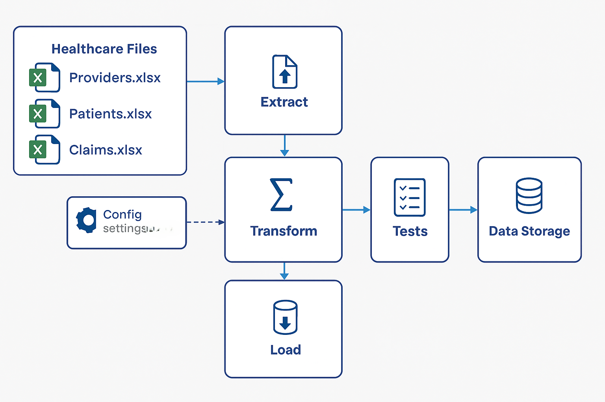
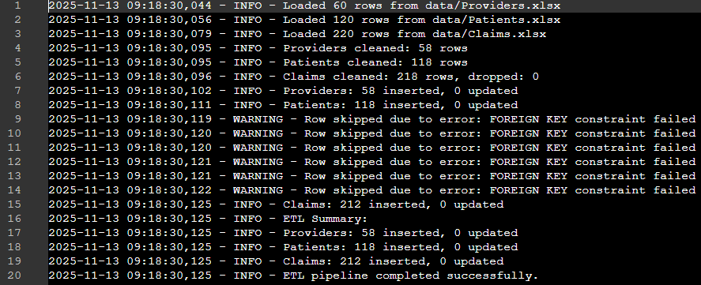
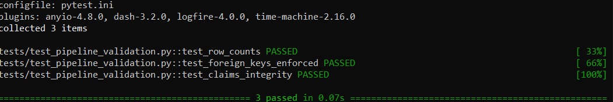
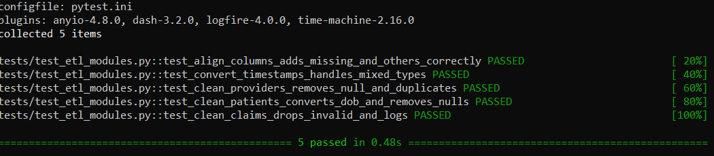

#  Healthcare ELT Pipeline


### Overview

This project implements a modular ELT (Extract, Load, Transform) pipeline for healthcare data integration. It ingests Excel files containing provider, patient, and claims data, applies cleaning and validation logic, and loads the results into a SQLite database.

### Visual Diagram of the Healthcare ELT Pipeline
```
+-------------------+     +---------------+     +-------------+     +----------------+
|     Providers     |     |    Patients   |     |    Claims   |     |     Config     |
+-------------------+     +---------------+     +-------------+     +----------------+
         |                       |                    |                     |
         |                       |                    |                     |
         v                       v                    v                     v
    +-------------------[ extract ]---------------------------------------------+
    |                                                                           |
    +-------------------[ transform ]-------------------------------------------+
    |                                                                           |
    +-------------------[ load ]------------------------------------------------+
         |                                                                  |
         v                                                                  v
+---------------------------------+                              +-------------------+
|           Database              |                              |        log        | 
+---------------------------------+                              +-------------------+
```



### Project Structure 
```
healthcare_elt_pipeline/
├── config/
│   └── settings.yaml
├── data/
│   ├── Providers.xlsx
│   ├── Patients.xlsx
│   └── Claims.xlsx
├── images/
│   ├── LogScreenshot.png
│   ├── ELT_ModulesTestScreenshot.png
│   ├── ELT_ValidationTestScreenshot.png
│   └── ELTdiagram.png 
├── logs/
│   └── pipeline.log
├── src/
│   ├── __init__.py
│   ├── config_loader.py          
│   ├── extract.py
│   ├── load.py
│   ├── schema_definitionsload.py
│   ├── transform.py
│   └── utils.py    
├── tests/
│   ├── test_elt_modules.py
│   └── test_pipeline_validation.py                         
├── .gitignore                    
├── elt_pipeline.py              
├── pytest.ini             
├── README.md                   
└── requirements.txt                    
```

### How It Works

- Extract:
Reads structured healthcare data from Excel files (Claims.xlsx, Patients.xlsx, Providers.xlsx).
- Transform:
Applies schema validation, deduplication, and normalization using modular Python scripts.
- Load:
Inserts cleaned data into a SQLite database (healthcare.db) with schema enforcement.
- Config Management:
Uses settings.yaml and .env for dynamic configuration and secure secret handling.
- Validation:
Includes automated tests for pipeline integrity and schema compliance.
- Logging:
Logs for data quality and pipeline progress


---

### Setup Instructions

1. **Clone the repository**

```bash
git clone https://github.com/mydevground/healthcare_elt_pipeline.git
cd healthcare_elt_pipeline
```

2. **Install dependencies**

```bash
pip install -r requirements.txt
```

3. **Configure settings**

Edit `Set the CONFIG_PATH to your config/settings.yaml in your .env file in the root folder. src/config_loader.py will be using both .Yaml and .env`. Update accordingly. With this flexibility, it can be modified later to use critical credentials in the future depending on the use case. For example, adding messaging services like email, slack, ms teams or monitoring tools like Azure monitor, New Relic, DataDog, Splunk and so on.

---

### How to Run

Make sure .env and config/settings.yaml are properly configured


```bash
python etl_pipeline.py
```

Logs will be written to `logs/pipeline.log` and the database will be created at the path specified in `settings.yaml`.

---

### Key Decisions

- **Schema Design**
- **Invalid References**
- **Idempotency**
- **Missing Data**
- **Invalid Date**
- **Secure Config Option**


---

### General Log Output



---

### Testing
Includes:
- test_elt_modules.py: Unit tests for extract, transform, load
- test_pipeline_validation.py: End-to-end pipeline checks


#### Validation Script

```bash
pytest tests/test_pipeline_validation.py
```

Validates:
- Row counts for each table
- Table relationships
- Referential integrity of claims

#### Validation Test Log Output



#### Unit Tests

```bash
pytest tests/test_etl_modules.py
```

Covers:
- Deduplication
- Date parsing
- Amount validation
- Reference filtering

#### Modules Test Log Output



---

## Alternatives for Production(Based on Experience and Best Practices):

- Scaling Strategy for Production Deployment (Azure Data Factory)
- Scaling Strategy for Production Deployment (Databricks or Azure Databricks)
- Incremental Load Strategy for Production Deployment
- Monitoring Strategy for Production (e.g Azure Monitor,New Relic, Splunk etc.)

---
The above are discused bellow:
---

## Scaling Strategy for Production Deployment (Azure Data Factory)

To ensure scalability, maintainability, and secure operations in a production environment, the current ELT pipeline can be re-architected using **Azure Data Factory (ADF)**. This approach leverages native cloud services to orchestrate data workflows, enforce governance, and support enterprise-grade reliability.

### My Recommended ADF Key Components and Flow

- **ADF Pipelines**  
  Coordinate end-to-end data ingestion from Azure Blob Storage, enabling modular orchestration of extract, transform, and load stages.

- **Mapping Data Flows**  
  Perform scalable, code-free transformations and validations directly within ADF, including schema enforcement, deduplication, and conditional logic.

- **Linked Services**  
  Establish secure, reusable connections to data sources such as Azure SQL Database, Blob Storage, and external file systems, with centralized credential management.

- **Triggers**  
  Automate pipeline execution using time-based (e.g., nightly) or event-driven triggers to support continuous data integration and reporting.

- **Azure Key Vault Integration**  
  Protect sensitive credentials and secrets by integrating Key Vault with ADF, ensuring secure access control and auditability across environments.

---

### This approach supports:
- Modular scaling across environments
- Secure credential handling via Key Vault
- Robust scheduling and monitoring
- Seamless integration with existing Azure services

---

This flowchart illustrates the full production-grade pipeline:
- Healthcare Files (Excel) ingested from Azure Blob Storage
- ADF Pipelines orchestrate the ELT flow
- Mapping Data Flows apply transformations and validations
- Config loaded from  and managed via Azure Key Vault
- Linked Services securely connect to Azure SQL Database
- Triggers schedule nightly or event-based runs
- Validation ensures data integrity and schema compliance


---

## Scaling Strategy for Production Deployment (Databricks or Azure Databricks)

To support enterprise-scale healthcare data processing, the ELT pipeline can be re-implemented using **Azure Databricks**, leveraging Spark-based distributed computing, secure credential management, and modular orchestration.

### My Recommended Azure Databricks Key Components and Flow

- **Extraction**  
  Source files such as Excel or CSV are ingested from Azure Blob Storage or Data Lake using Spark notebooks or Databricks Jobs. This replaces local file-based extraction with scalable, cloud-native ingestion.

- **Transformation**  
  Data cleansing, normalization, deduplication, and schema enforcement are performed using Spark DataFrame operations. These transformations are modularized into notebooks or Python scripts, enabling parallel processing and reusability.

- **Loading**  
  Transformed data is written to persistent storage such as Azure SQL Database, Delta Lake, or Synapse using JDBC connectors. This ensures structured, queryable output for downstream analytics and reporting.

- **Configuration Management**  
  Secrets and parameters are securely managed using Databricks Secrets and notebook widgets. This replaces `.env` and `settings.yaml` with cloud-native config injection, supporting environment-specific overrides and auditability.

- **Validation and Testing**  
  Data quality checks, schema validations, and referential integrity tests are embedded within notebooks or executed via Pytest. These ensure pipeline correctness and compliance with healthcare data standards.

- **Orchestration**  
  The entire pipeline is scheduled and monitored using Databricks Jobs and Workflows. This supports retry logic, alerting, and dependency chaining across extract, transform, and load stages.

---

### This approach supports:

- Distributed processing for large datasets  
- Native integration with Azure services (Blob, SQL, Key Vault)  
- Secure credential handling and audit trails  
- Modular development with notebooks and CI/CD support  
- Interactive debugging and rapid iteration

---

##  Incremental Load Strategy For Production

To ensure efficient and reliable ingestion of healthcare data in production, this pipeline supports multiple incremental load patterns tailored to the nature of each source table.

### 1. Nightly Appends

For insert-only tables such as `Claims`, new records are appended nightly:

- Filter source data using `last_updated` or `created_at` timestamp
- Track `last_run_timestamp` in a metadata store or config file
- Validate with row counts and primary key checks

```sql
SELECT * FROM claims
WHERE last_updated > '{{ last_run_timestamp }}'
```

### 2. Slowly Changing Dimensions (SCD Type 2)

For reference tables like `Patients` and `Providers`:

- Detect changes using hash comparisons or key diffs
- Expire old records (`valid_to`) and insert new versions with `valid_from`
- Maintain `is_current`, `valid_from`, `valid_to` columns for historical tracking

```sql
MERGE INTO dim_patient AS target
USING staging_patient AS source
ON target.patient_id = source.patient_id
WHEN MATCHED AND target.hash != source.hash THEN
  UPDATE SET target.valid_to = CURRENT_DATE, target.is_current = FALSE
WHEN NOT MATCHED THEN
  INSERT (...)
```

### 3. Truncate & Load

For small, static lookup tables (e.g., ICD codes):

- Truncate and reload fully
- Schedule less frequently (weekly/monthly)
- Validate with row comparisons or checksums

```sql
TRUNCATE TABLE dim_icd_codes;
INSERT INTO dim_icd_codes SELECT * FROM staging_icd_codes;
```

### 4. Hybrid Strategy

Use a config-driven approach to define load type per table:

```yaml
load_strategy:
  claims: append
  patients: scd2
  providers: scd1
  icd_codes: truncate
```

This enables modular control and extensibility across environments.

### 5. Operational Best Practices

-  **Audit Logging**: Track row counts, timestamps, and errors per run  
-  **Idempotency**: Ensure re-runs don’t duplicate or corrupt data  
-  **Validation Suite**: Include schema checks, referential integrity, and KPI deltas  
-  **Scheduling**: Use ADF triggers, Airflow DAGs, or Databricks Jobs  
-  **Metadata Store**: Persist `last_run_timestamp`, load status, and versioning

---

##  Production Monitoring Strategy 

Implementing a monitoring solution is essential for maintaining reliability, detecting anomalies, and supporting compliance in data pipelines. Below are three robust options tailored for cloud-native and hybrid environments:

---

###  Option 1: Azure Monitor (Native to Azure)

**Best for:** Azure-hosted pipelines (ADF, Databricks, SQL DB, Blob Storage)

- **Log Collection**: Enable diagnostic settings on ADF, Databricks, and SQL resources to stream logs to Log Analytics
- **Querying**: Use Kusto Query Language (KQL) to analyze pipeline runs, error rates, and latency
- **Dashboards**: Create custom views for ETL stages, data volumes, and failure trends
- **Alerts**: Configure alerts on failed activities, long runtimes, or missing data
- **Integration**: Seamlessly connects with Azure Key Vault, Application Insights, and Defender for Cloud

```kql
ADFActivityRun
| where Status == "Failed"
| summarize count() by ActivityType, PipelineName, ErrorCode
```

---

###  Option 2: New Relic

**Best for:** Multi-cloud or hybrid environments with Python-based ELT

- **Log Forwarding**: Use New Relic’s Fluent Bit or custom Python SDK to stream logs from `pipeline.log`
- **Instrumentation**: Add custom events for extract, transform, load stages
- **Dashboards**: Visualize throughput, error rates, and SCD versioning metrics
- **Alerts**: Trigger notifications on threshold breaches or missing KPIs
- **Security**: Supports HIPAA-compliant configurations for healthcare workloads

---

###  Option 3: Splunk

**Best for:** Enterprise-scale log aggregation and compliance

- **Log Ingestion**: Forward logs from ELT scripts, ADF, Databricks, and SQL audit logs
- **Search & Correlation**: Use SPL (Search Processing Language) to detect anomalies across services
- **Dashboards**: Build visual summaries of pipeline health, load volumes, and incremental logic
- **Alerts & Actions**: Automate remediation or ticket creation via Splunk On-Call
- **Compliance**: Supports audit trails and retention policies for healthcare data governance

---

##  What to Monitor

- Pipeline success/failure rates  
- Runtime duration and latency spikes  
- Data volume anomalies (e.g., missing claims)  
- Credential or config errors  
- SCD versioning and row changes  
- Load completion and target row counts

---


  


